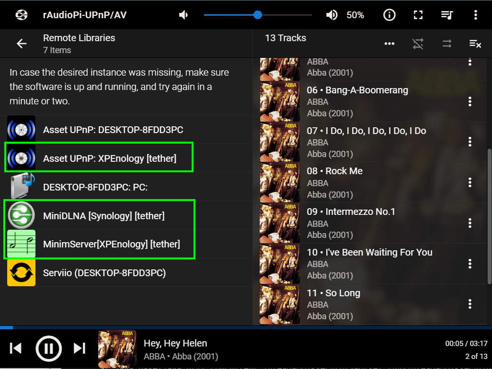

# LMS-BubbleUPNP Server (for ArchLinux: rAudio...)
>
1./ In LMS (Logitech Media Server) activate the "Remote Music Libraries" plugin. In the "Remote Music Libraries" settings, navigate to "UPnP/DLNA Client" and select "Enabled". This will allow you to discover other UPnP/DLNA media servers.
> 
------------------------
>
2./ Install package: Java runtime, Unzip, BubbleUPnP Tether Client, SSH Putty command:
> wget -O - https://raw.githubusercontent.com/lovehifi/lmsbub/main/install-archlinux.sh | sh
>
------------------------
>
3./ WinSCP edit config (or nano edit): /opt/upnp/bupnp.service
Add username, pass, URL server
> ExecStart=/opt/upnp/launch.sh -connect http://yourserver:58050 -login yourusername -password yourpassword
>
------------------------
>
4./ Run bupnp.service, SSH Putty command:
>
> sudo systemctl daemon-reload
>
> sudo systemctl restart bupnp.service
>
> sudo systemctl status bupnp.service
>
------------------------
You can connect to the BubbleUPNP Server either through the Internet or locally to access and listen to your music.
Wait a few minutes for LMS to display the available servers.

BubbleUPNP Server (tether) Screenshot

## rAudioBub: Enhanced Integration for rAudio

Explore this [rAudioBub GitHub Repository](https://github.com/lovehifi/raudiobub) for an alternative solution that enhances rAudio functionality.
